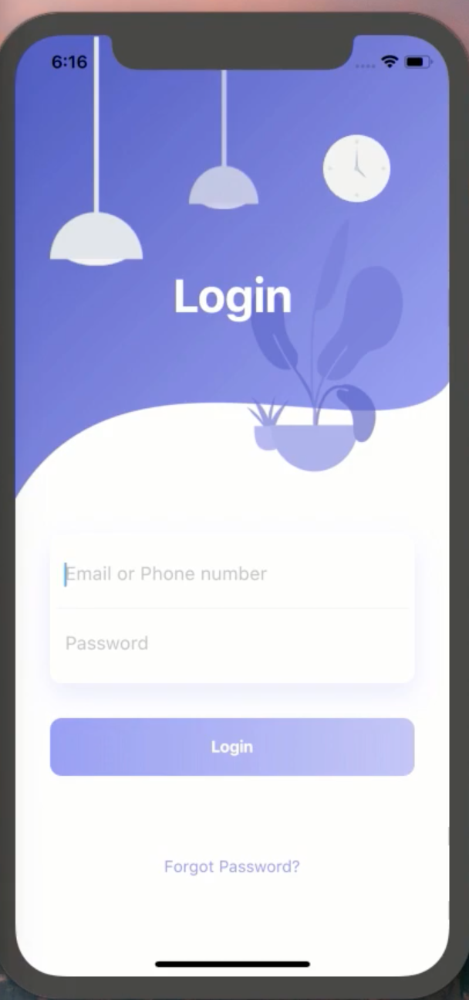

# Flutter Beautiful Login Page UI Design and Animation

Flutter Beautiful Login Page UI Design and Animation -  A basic login UI/UX design for beginners help.

This repository is a part of the 100-day design in Flutter.

Here we use,Flutter Features like: Animation, Stack, Positioned, BoxShadow, TextField, Gradient, LinearGradient ..so on 

